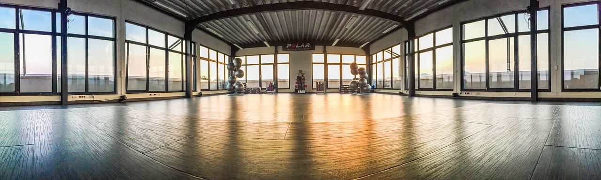

# Kapitel 1: Geschäftsmodelle und Vertriebswege analysieren

In diesem Kapitel ...

- ... 

---

## Handlungssituation

Die ChangeIT GmbH möchte das Angebot für seine Kunden zukünftig umfassender gestalten und hat eine kleine Unternehmensberatung als Abteilung eingekauft. Sie nehmen die Rolle zwischen Informationstechnologie und der Gestaltung von Geschäftsmodellen sowie -prozessen in einer neu geschaffenen Stelle ein.

Für Ihren ersten Auftrag in der neuen Position setzen Sie sich genauer mit der Analyse des Kunden "Fitness 365 GmbH" und seiner Geschäftsfelder auseinander.

---

## Kompetenz 1.0: Problemsituation analysieren

Die Fitness 365 GmbH ist ein Familienunternehmen, welches im vergangenen Jahr durch die Tochter vom Gründer übernommen wurde. Als neue Geschäftsführerin hat Frau Schmidt in einer Projektmappe zusammengefasst, wie der aktuelle Stand des Unternehmens ist. Sie sollen sich mithilfe der Zusammenfassung einen Überblick verschaffen.

---

### Arbeitsauftrag A|1.0: Analysieren des Kunden

1. Lesen Sie sich den Auszug aus der Projektmappe (Informationsmaterial M|1.0) durch.
2. Stellen Sie die darin enthaltenen Informationen in Form einer Mindmap kurz zusammen.
3. Mit welchen Strategien könnten sinnvolle Handlungen zur Verbesserung des Unternehmens gefunden werden?

---

### Informationsmaterial M|1.0: Auszug aus der Projektmappe

Sehr geehrte Damen und Herren der ChangeIT,

es freut mich, dass Sie nun neben der IT-Ausstattung auch den Zweig einer Unternehmensberatung anbieten. Mein Vater hatte über die letzten Jahre den Service Ihrerseits für die Wartungstätigkeiten an unseren Arbeitsplätzen am Tresen für die einzelnen Niederlassungen in Anspruch genommen. Wie telefonisch mitgeteilt bin ich ab jetzt Ihre Ansprechpartnerin bei Fitness 365. Gerne würde ich mir von Ihnen einen Überblick geben lassen, wie ich das Unternehmen für die Zukunft ausrichten kann.

- Wir sind mit 5 Fitnessstudios in Hannover (innenstadtnah) und der Region (Wunstorf, Burgdorf, Lehrte und Sehnde) aufgestellt.
    - Unsere Standorte in Wunstorf und Burgdorf liegen jeweils sehr nahe am Bahnhof.
    - Die Niederlassungen in Lehrte und Sehnde sind etwas außerhalb der Zentren und mit dem ÖPNV nicht erreichbar.
- An jedem Standort haben wir jeweils eine Person als Niederlassungsleitung. Diese wird durch 3 Trainer:innen in zwei Schichten unterstützt. 
- Unsere Kunden kommen zu den Öffnungszeiten (i.d.R. zwischen 10:00 und 20:00 Uhr) für ihr Training in die Studios. 
- Unregelmäßig bieten wir auch einzelne Kurse in den Gymnastik-Räumen an.
- Wir haben ca. 150 Kundenverträge je Niederlassung, welche mit einem Beitrag von 35,00 EUR je Monat und einer Vertragslaufzeit von einem Jahr laufen.
- Von den Kundenverträgen haben wir ca. 50%, die sehr regelmäßig zum Training kommen, 30% unregelmäßig Trainierende sowie 20%, die inaktiv sind, aber noch zahlen. Über die letzten Jahre hat auch ohne Corona-Effekte die Mitgliederanzahl abgenommen. Corona hat uns dann fast zur Geschäftsaufgabe gezwungen.
- Gutscheine, die wir für Neukunden / Schnuppertage für 10,00  EUR pro Trainingswoche anbieten - und wir via Tageszeitung bewerben - umfassen eine 70% Realisierung, aber auch 30% No-Shows.
- Unsere Geräte sind bereits gut 10 Jahre alt und werden bei defekt durch einen externen Service-Mitarbeiter repariert. Wir haben das Feedback einiger Kunden, dass diese sich neuere Modelle wünschen, die mit Smartwatches etc. koppelbar sind.
- Ein Marketingkonzept gibt es in diesem Sinne nicht, wir schalten unregelmäßig in der Tageszeitung Werbung.
- Kooperationen oder Partnerschaften haben wir nicht.

Ich würde gerne vieles modernisieren und habe mir auch schon erste Gedanken gemacht. Es fällt mir allerdings schwer, einen Anfang zu finden. Auch die Abstimmung der einzelnen Maßnahmen traue ich mir alleine nicht zu. Ich habe eine große Verantwortung für meine Mitarbeiter:innen und möchte keine voreiligen Änderungen vornehmen.

Über ein Konzept und Maßnahmen zur Verbesserung der Fitness 365 würde ich mich freuen.

Mit freundlichen Grüßen

Vivian Schmidt

---

## Kompetenz 1.1: Unternehmen umfassend analysieren

Die Informationen von Frau Schmidt sind zwar schon recht umfassend, allerdings auch lückenhaft. Außerdem fehlt eine Sortierung, sodass systematisch nach Verbesserungspotenzialen gesucht werden kann. Eine Möglichkeit, diese Übersicht herzustellen ist das Business Model Canvas.

---

### Arbeitsauftrag A|1.1: Business Model Canvas erarbeiten

1. Erarbeiten Sie sich mithilfe des LinkedIn-Learning-Kurses den Aufbau des Business Model Canvas [BMC] (Informationsmaterial M|1.1).
2. Besprechen Sie Ihre Erkenntnisse zwischen den Videokapiteln oder am Ende mit Ihrer Gruppe und halten Sie Kriterien für die einzelnen Segmente fest.
3. Testen Sie anschließend kurz das passende Tool in [draw.io](draw.io) (Informationsmaterial M|1.2). Dazu wählen Sie bei der Übersicht erst Business und dann das BMC aus.

4. Laden Sie zur Fertigstellung dieser Aufgabe Ihr LinkedIn-Learning-Zertifikat als .pdf-Datei hoch.

### Informationsmaterial M|1.1: LinkedIn-Learning-Kurs zum Business Model Canvas

[Link zum Kurs](https://www.linkedin.com/learning-login/share?account=68522354&forceAccount=false&redirect=https%3A%2F%2Fwww.linkedin.com%2Flearning%2Fgeschaftsmodelle-mit-dem-business-model-canvas-entwickeln%3Ftrk%3Dshare_ent_url%26shareId%3DkUdBW8R1SXGqL48lFOlMXg%253D%253D)

---

### Informationsmaterial M|1.2: Tool-Tipp - draw.io

[draw.io](draw.io)

---

## Kompetenz 1.2: Business Model Canvas anwenden

Nachdem Sie sich das Konzept des Business Model Canvas und das Tool zur Erstellung erarbeitet haben, sollen Sie dieses für die Beratung von Frau Schmidt nutzen. Einerseits wenden Sie die Analyse auf den Kunden Fitness 365 an, andererseits haben Sie sich intern abgestimmt auch einen Branchenriesen als Vergleich heranzuziehen.

---

### Arbeitsauftrag A|1.2: Fitness 365 analysieren

1. Analysieren Sie in der Gruppe Fitness 365 anhand der bestehenden Informationen (Informationsmaterial M|1.0), indem Sie das Business Model Canvas anwenden.
2. Laden Sie Ihr Ergebnis der Gruppe in dieser Aufgabe hoch.

---

### Arbeitsauftrag A|1.3: McFit analysieren

1. Analysieren Sie in der Gruppe das Unternehmen McFit anhand der im Internet öffentlichen Informationen, indem Sie das Business Model Canvas anwenden.
2. Laden Sie Ihr Ergebnis der Gruppe in dieser Aufgabe hoch.

---

## Kompetenz 1.3: Ergebnisse bewerten und reflektieren

Die beiden durchgeführten Analysen stehen aktuell noch jeweils für sich. Damit eine Strategie für Fitness 365 abgeleitet werden kann, sollen die Business Model Canvas miteinander in Bezug gebracht werden.

---

### Arbeitsauftrag A|1.4: Weiterentwicklung des Unternehmens Fitness 365 

1. Nutzen Sie alleine Ihr zuvor in Arbeitsauftrag A|1.2 erstelltes Ergebnis und ergänzen Sie die Ist-Situation in einer anderen Farbe um einen Soll-Zustand, den Sie für realistisch einschätzen.
2. Gleichen Sie Ihr individuelles Ergebnis mit den Aspekten Ihrer Gruppe ab. Einigen Sie sich auf eine einheitliche Strategie.
3. Treffen Sie sich mit einer anderen Gruppe und führen Sie erneut einen Abgleich der Strategie durch. Einigen Sie sich nochmals auf eine Gesamtstrategie.
4. Welche Schwierigkeiten sind Ihnen bei Schritt 2. und 3. dieses Arbeitsauftrags aufgefallen?
5. Laden Sie Ihre Ergebnisse in dieser Aufgabe hoch.

---

