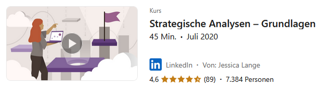

# Kapitel 2: Strategische Analysen für Geschäftsmodelle durchführen

In diesem Kapitel werden Sie ...

- ... sich näher mit einem oder zwei Unternehmen auseinandersetzen.
- ... die Historie der Unternehmen als Grundlage einer Strategiefindung rechercherchieren.
- ... eine Digitalstrategie als Emfpfehlung aufbereiten.

## Handlungssituation

Die ChangeIT GmbH möchte das Angebot für seine Kunden zukünftig umfassender gestalten und hat eine kleine Unternehmensberatung übernommen und als Abteilung integriert. Die Schnittstelle zwischen dem bisherigen IT-Systemhaus und der neuen Unternehmensberatungsschiene nehmen Sie ein.

Um die neue Abteilung auch den Bestandskunden des IT-Systemhauses bekannt zu machen, bemühen Sie sich um ein großes Referenzprojekt. Da kommt es Ihnen gelegen, dass im Rahmen der Wirtschaftsförderung von kleinen und mittelständischen Unternehmen (KMU) ein Wettbewerb des Technologie und Gründerzentrums ausgerufen wurde. An dem Wettbewerb beteiligen sich große Unternehmen, die auf neue Ansätze für Ihre Handlungen auf dem Markt bauen wollen.

Der Wettbewerb umfasst insbesondere die Weiterentwicklung der digitalen Produkte und Geschäftsmodelle der Konzerne. Bei entsprechender Qualität der Ergebnisse erhofft sich die ChangeIT auch über den Wettbewerb hinaus Aufträge aus dem Umfeld der großen Unternehmen.

Sie haben sich für ein Unternehmen entschieden. Führen Sie die Aufgaben in diesem Kapitel daher immer in Bezug auf die Handlungssituation des Wettbewerbs und auf das Unternehmen bzw. seine Branche durch.

Um eine Strategie für das gewählte Unternehmen ausarbeiten zu können, soll im ersten Schritt eine systematische Analyse des Unternehmens durchgeführt werden. Dazu haben Sie zusammen mit Ihrer Gruppe ein Dokument vorbereitet, das entsprechend gefüllt werden muss.

## Kompetenz 2.0: Strategische Analysen unterscheiden

Wie ist das von Ihnen ausgewählte Unternehmen eigentlich im Markt verortet? Welche Stärken oder Schwächen sind ersichtlich? Wie ist die Konkurrenz einzuschätzen? All diese Fragen betreffen die Marktanalyse mit ihren verschiendenen Instrumenten.

### A|2.0: Strategische Analysen erarbeiten 

Erarbeiten Sie sich mithilfe des LinkedIn-Learning-Kurses im Informationsmaterial (M|2.0.0: LinkedIn-Learning-Kurs zu strategischen Analysen) die strategischen Analysen (z.B. in Form einer Mindmap). Beantworten Sie die Kapiteltests und laden Sie als Aktivitätsnachweis das PDF-Zertifikat in dieser Aufgabe hoch.

### M|2.0.0: LinkedIn-Learning-Kurs zu strategischen Analysen 

[Videokurs aufrufen](https://www.linkedin.com/learning/strategische-analysen-grundlagen/aussagekraftige-analysen-fur-zielgerichtetes-unternehmerisches-handeln)

## Kompetenz 2.1: Strategische Analyse eines Unternehmens durchführen

Nachdem Sie sich mit den strategischen Analysen auseinandergesetzt haben, sollen diese für die genaue Betrachtung des gewählten Unternehmens angewendet werden.

### A|2.1: Stategische Analysen durchführen 

Führen Sie die im LinkedIn-Kurs dargestellten Analysen für Ihr ausgewähltes Unternehmen und seine Branche durch.

Wie Sie die Arbeit innerhalb der Gruppe aufteilen, kann von Ihnen entschieden werden. Wichtig ist, dass alle Gruppenmitglieder am Ende ...

- ... jede Analyse auch selbst durchführen können,
- ... über die Ergebnisse im Bilde sind,
- ... das Gesamtergebnis der Gruppe vertreten.

**Aufgabe 1**

Beschreiben Sie für jede Analyse ihre Eigenschaften sowie Vorteile und Grenzen (Kritische Würdigung).

**Aufgabe 2**

Die einzelnen Analysen sollen durchgeführt und auf das gewählte Unternehmen und seine Branche angewendet werden.

**Aufgabe 3**

Das Ergebnis soll grafisch aber auch textlich als Einordnung beschrieben sein.

**Aufgabe 4**

Eine kurze Bewertung des Ergebnisses und eine Reflexion des Erstellungsprozesses stehen am Ende. Wie sind Sie im Rahmen der jeweiligen Analyse vorgegangen? Welche Schwierigkeiten hatten Sie? Wie haben Sie die Probleme gelöst?

**Hinweise zur Abgabe**

- Halten Sie fest, welche Quellen Sie für Informationen im Rahmen der Analysen verwendet haben.
- Sollten Sie zur Informationseinholung oder ähnlichen Prozessschritten KI-Tools anwenden, ist zwingend der M|0.3: KI-Leitfaden für den Unterricht einzuhalten.
- Sie geben als Gruppe gemeinsam ein Dokument mit allen bearbeiteten Analysen ab. Eine Person aus der Gruppe lädt das Dokument als Gruppenlösung in der Aufgabe hoch. Nach Upload gilt die Einreichung als vollständig. Eingereichte Dokumente können durch jedes Gruppenmitglied nochmals aktualisiert hochgeladen werden.

## Handlungsergebnis

Für die erste Phase des Wettbewerbs haben Sie verschiedene strategische Analysen für das ausgewählte Unternehmen durchgeführt. Diese sollen nun im Gesamtreader des Projektes entsprechend dargestellt und kurz schriftlich ausgewertet werden. Dieser Schritt bildet den Abschluss der Phase und damit einen Meilenstein des Wettbewerbs.

### A|2.2: Dokumentation der strategischen Analysen erstellen Aufgabe

Wie Sie die Arbeit innerhalb der Gruppe aufteilen, kann von Ihnen entschieden werden. Wichtig ist, dass alle Gruppenmitglieder am Ende ...

- ... jede Analyse auch selbst durchführen können,
- ... über die Ergebnisse im Bilde sind,
- ... das Gesamtergebnis der Gruppe vertreten.

**Aufgabe 1**

Erstellen Sie das Deckblatt der Dokumentation im vorbereiteten Design (M|2.2.0: Projektdokumentation für den Wettbewerb).

**Aufgabe 2**

Nutzen Sie die Ergebnisse aus den Aufgaben A|2.0: Strategische Analysen erarbeiten und A|2.1: Stategische Analysen durchführen zur Vervollständigung der Dokumentation im Rahmen des Wettbewerbs und betten Sie diese an den entsprechenden Stellen im Gesamtdokument ein.

**Aufgabe 3**

Reflektieren Sie gemeinsam Ihre Arbeit als Gruppe. Nutzen Sie dazu das Informationsmaterial M|2.2.1: Reflexion von Gruppenarbeiten als Hilfestellung. Sie müssen nicht alle Fragen, die in dem Material aufgeführt sind beantworten. Greifen Sie sich als Gruppe die für Sie wichtigen Themen heraus. Die Reflexion wird als gemeinsame Datei ebenfalls in dieser Aufgabe abgegeben. Ihre Reflexion sollte genau eine DIN A4-Seite umfassen. Nutzen Sie dafür die Vorlage M|2.2.2: Vorlage zur Reflexion.

**Hinweise zur Abgabe**

- Erstellen Sie im Dokument ein Literaturverzeichnis, in welchem Sie die Quellen für Ihre Analysen angeben.
- Sollten Sie zur Informationseinholung oder ähnlichen Prozessschritten KI-Tools anwenden, ist zwingend der M|0.3: KI-Leitfaden für den Unterricht einzuhalten.
- Benennen Sie die Dokumente nach folgendem Muster:
    - Unternehmen_Doku_1_NachnameV_NachnameV_NachnameV_NachnameV.pdf
    - Unternehmen_Reflexion_1_NachnameV_NachnameV_NachnameV_NachnameV.pdf
- Sie geben als Gruppe gemeinsam ein Dokument mit allen bearbeiteten Analysen sowie die Reflexion ab. Eine Person aus der Gruppe lädt das Dokument als Gruppenlösung in der Aufgabe hoch. Nach Upload gilt die Einreichung erst dann als vollständig, wenn alle Gruppenmitglieder die Abgabe in Moodle über den entsprechenden Button bestätigt haben. Eine Änderung ist im Anschluss nicht möglich.
- Das Bewertungsraster für die Abgabe 1 finden Sie im M|2.2.3: Bewertungsraster zur Abgabe 1

### M|2.2.0: Projektdokumentation für den Wettbewerb

[Dowload der Vorlage zur Projektdokumentation](material/02_ChangeIT_Projektdoku_KDM_LF12.docx)

### M|2.2.1: Reflexion von Gruppenarbeiten

[Download der Hilfestellung zur Reflexion](material/02_Reflexion_der_Gruppenarbeit.pdf)

### M|2.2.2: Vorlage zur Reflexion

[Download der Vorlage zur Reflexion](material/02_Reflexion_Vorlage.docx)

### M|2.2.3: Bewertungsraster zur Abgabe 1

[Download des Bewertungsrasters](material/02_Bewertungsraster_Abgabe_1.xlsx)

