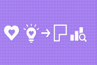
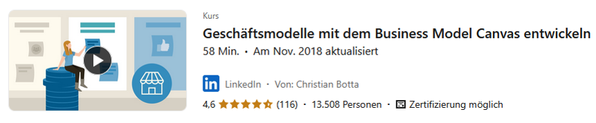

# Kapitel 3: Geschäftsprozesse einrichten und optimieren

In diesem Kapitel werden Sie ...

- ... die Unternehmen nach internen und externen Faktoren durchleuchten.
- ... das Business Model Canvas zur Analyse einsetzen.

## Handlungssituation

Die ChangeIT GmbH möchte das Angebot für seine Kunden zukünftig umfassender gestalten und hat eine kleine Unternehmensberatung übernommen und als Abteilung integriert. Die Schnittstelle zwischen dem bisherigen IT-Systemhaus und der neuen Unternehmensberatungsschiene nehmen Sie ein.

Um die neue Abteilung auch den Bestandskunden des IT-Systemhauses bekannt zu machen, bemühen Sie sich um ein großes Referenzprojekt. Da kommt es Ihnen gelegen, dass im Rahmen der Wirtschaftsförderung von kleinen und mittelständischen Unternehmen (KMU) ein Wettbewerb des Technologie und Gründerzentrums ausgerufen wurde. An dem Wettbewerb beteiligen sich große Unternehmen, die auf neue Ansätze für Ihre Handlungen auf dem Markt bauen wollen.

Der Wettbewerb umfasst insbesondere die Weiterentwicklung der digitalen Produkte und Geschäftsmodelle der Konzerne. Bei entsprechender Qualität der Ergebnisse erhofft sich die ChangeIT auch über den Wettbewerb hinaus Aufträge aus dem Umfeld der großen Unternehmen.

Sie haben sich für ein Unternehmen entschieden. Führen Sie die Aufgaben in diesem Kapitel daher immer in Bezug auf die Handlungssituation des Wettbewerbs und auf das Unternehmen bzw. seine Branche durch.

Die Darstellung von Informationen zu einem Unternehmen kann in Form von Canvas (visuelle Strukturierungshilfen) erfolgen. Eines der bekanntesten ist dabei das Business Model Canvas, welches verschiedene Dimensionen des Unternehmens darstellt. Ihre zuvor erzielten Ergebnisse der unterschiedlichen Analysen sollen im nächsten Schritt als Basis zur Darstellung des Unternehmens als One-Pager dienen.

## Kompetenz 3.0: Business Model Canvas kennenlernen

Das Business Model Canvas dient als Strukturierungshilfe für die Darstellung eines Unternehmens. Dabei werden verschiedene Elemente des Unternehmens separat voneinander betrachtet. Im Rahmen des Wettbewerbs ist dies der letzte Schritt vor der Beratungsleistung.

### A|3.0: Business Model Canvas erarbeiten

Erarbeiten Sie sich mithilfe des LinkedIn-Learning-Kurses im Informationsmaterial (M|3.0.0: LinkedIn-Learning-Kurs zum Business Model Canvas) das Business Model Canvas (z.B. in Form einer Mindmap). Beantworten Sie die Kapiteltests und laden Sie als Aktivitätsnachweis das PDF-Zertifikat in dieser Aufgabe hoch.

### M|3.0.0: LinkedIn-Learning-Kurs zum Business Model Canvas

[Videokurs aufrufen](https://www.linkedin.com/learning-login/share?account=68522354&forceAccount=false&redirect=https%3A%2F%2Fwww.linkedin.com%2Flearning%2Fgeschaftsmodelle-mit-dem-business-model-canvas-entwickeln%3Ftrk%3Dshare_ent_url%26shareId%3DkUdBW8R1SXGqL48lFOlMXg%253D%253D)

### M|3.1.0: Tool-Tipp - https://app.diagrams.net/

Über https://app.diagrams.net/ (ehemals draw.io) finden Sie in den Vorlagen im Bereich Business das Business Model Canvas.

## Kompetenz 3.1: Business Model Canvas erstellen

Nachdem Sie das Business Model Canvas kennengelernt haben, soll dieses für das von Ihnen gewählte Unternehmen erstellt werden. Die Informationen hierzu sind Ihnen zum Teil bereits aus der ersten Phase - den strategischen Analysen - bekannt. Weitere Aspekte sind zu recherchieren.

### A|3.1: Business Model Canvas erstellen

Erstellen Sie das im LinkedIn-Kurs dargestellte Business Model Canvas für Ihr ausgewähltes Unternehmen und seine Branche.

Wie Sie die Arbeit innerhalb der Gruppe aufteilen, kann von Ihnen entschieden werden. Wichtig ist, dass alle Gruppenmitglieder am Ende ...

- ... die gesamte Analyse auch selbst durchführen können,
- ... über die Ergebnisse im Bilde sind,
- ... das Gesamtergebnis der Gruppe vertreten.

**Aufgabe 1**

Beschreiben Sie stichpunktartig das von Ihnen gewählte Unternehmen im aktuellen Stand mithilfe der Segmente im Business Model Canvas.

**Aufgabe 2**

Eine kurze Bewertung des Ergebnisses und eine Reflexion des Erstellungsprozesses stehen am Ende. Wie sind Sie im Rahmen der jeweiligen Analyse vorgegangen? Welche Schwierigkeiten hatten Sie? Wie haben Sie die Probleme gelöst?

**Hinweise zur Abgabe**

- Halten Sie fest, welche Quellen Sie für Informationen im Rahmen der Analysen verwendet haben.
- Sollten Sie zur Informationseinholung oder ähnlichen Prozessschritten KI-Tools anwenden, ist zwingend der M|0.3: KI-Leitfaden für den Unterricht einzuhalten.
- Sie geben als Gruppe gemeinsam ein Dokument mit allen bearbeiteten Analysen ab. Eine Person aus der Gruppe lädt das Dokument als Gruppenlösung in der Aufgabe hoch. Nach Upload gilt die Einreichung als vollständig. Eingereichte Dokumente können durch jedes Gruppenmitglied nochmals aktualisiert hochgeladen werden.
 
## Handlungsergebnis

Für die zweite Phase des Wettbewerbs haben Sie das Business Model Canvas für das ausgewählte Unternehmen durchgeführt. Dieses soll nun im Gesamtreader des Projektes entsprechend dargestellt und kurz schriftlich ausgewertet werden. Dieser Schritt bildet den Abschluss der zweiten Phase und damit einen Meilenstein des Wettbewerbs.

### A|3.2: Dokumentation zum Business Model Canvas erstellen

Wie Sie die Arbeit innerhalb der Gruppe aufteilen, kann von Ihnen entschieden werden. Wichtig ist, dass alle Gruppenmitglieder am Ende ...

- ... jede Analyse auch selbst durchführen können,
- ... über die Ergebnisse im Bilde sind,
- ... das Gesamtergebnis der Gruppe vertreten.

**Aufgabe 1**

Nutzen Sie die Ergebnisse aus den Aufgaben A|3.0: Business Model Canvas erarbeiten erarbeiten und A|3.1: Business Model Canvas erstellen zur Vervollständigung der Dokumentation (Ihre Abgabe aus A|2.2: Dokumentation der strategischen Analysen erstellen) im Rahmen des Wettbewerbs und betten Sie diese als Kapitel "3 Business Model Canvas" in das Gesamtdokument ein.

**Aufgabe 2**

Beschreiben Sie unter "3.1 Vorstellung des Tools Business Model Canvas" erst allgemein, was das Business Model Canvas ist, welche Segmente es gibt und welche Fragestellungen mit ihnen gelöst werden können. Anschließend betten Sie in "3.2 Anwendung des Tools Business Model Canvas" das ausgefüllte Business Model Canvas zu dem von Ihnen gewählten Unternehmen ein. Zum Schluss beschreiben Sie zusammenfassend die Auswertung in "3.3 Einordnung des Business Model Canvas" und geben erste Ausblicke, in welche Richtung sich das Unternehmen weiterentwicklen könnte. Haben Sie dabei vor allem digitale (!) Produkte und Geschäftsmodelle im Fokus.

**Aufgabe 3**

Reflektieren Sie gemeinsam Ihre Arbeit als Gruppe. Nutzen Sie dazu das bereits bekannte Informationsmaterial M|2.2.1: Reflexion von Gruppenarbeiten als Hilfestellung. Sie müssen nicht alle Fragen, die in dem Material aufgeführt sind beantworten. Greifen Sie sich als Gruppe die für Sie wichtigen Themen heraus. Die Reflexion wird als gemeinsame Datei ebenfalls in dieser Aufgabe abgegeben. Ihre Reflexion sollte genau eine DIN A4-Seite umfassen. Nutzen Sie dafür erneut die Vorlage M|2.2.2: Vorlage zur Reflexion.

**Hinweise zur Abgabe**

- Erweitern Sie im Dokument das Literaturverzeichnis, in welchem Sie die Quellen für Ihre Analysen angeben.
- Sollten Sie zur Informationseinholung oder ähnlichen Prozessschritten KI-Tools anwenden, ist zwingend der M|0.3: KI-Leitfaden für den Unterricht einzuhalten.
- Benennen Sie die Dokumente nach folgendem Muster:
  - Unternehmen_Doku_2_NachnameV_NachnameV_NachnameV_NachnameV.pdf
  - Unternehmen_Reflexion_2_NachnameV_NachnameV_NachnameV_NachnameV.pdf
- Sie geben als Gruppe gemeinsam ein Dokument mit dem Business Model Canvas sowie die Reflexion ab. Eine Person aus der Gruppe lädt das Dokument als Gruppenlösung in der Aufgabe hoch. Nach Upload gilt die Einreichung erst dann als vollständig, wenn alle Gruppenmitglieder die Abgabe in Moodle über den entsprechenden Button bestätigt haben. Eine Änderung ist im Anschluss nicht möglich.
- Das Bewertungsraster für die Abgabe 2 finden Sie im M|3.2.0: Bewertungsraster zur Abgabe 2.

### M|3.2.0: Bewertungsraster zur Abgabe 2

[Download des Bewertungsrasters](material/03_Bewertungsraster_Abgabe_2.xlsx)

