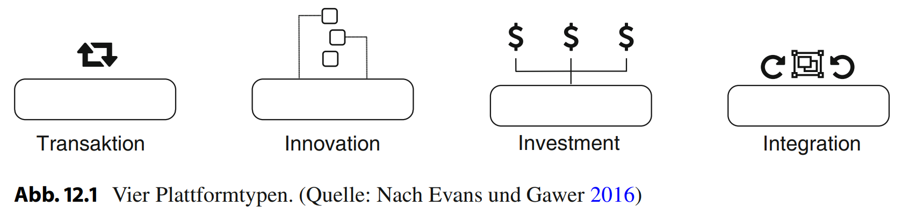

# Kapitel 3: Geschäftsprozesse einrichten und optimieren

In diesem Kapitel finden Sie ...

- ... die Analyse und Darstellung von Geschäftsprozessen,
- ... die Optimierung von Abläufen sowie
- ... das Einführen von Plattformen für Unternehmen.

## Handlungssituation

Der Kunde "Fitness 365 GmbH" hat sich für zwei Schritte entschieden:

- Einerseits sollen die Prozesse vor Ort in den Studios, die unmittelbar mit den Mitgliedern zu tun haben, optimiert werden. Die Verwaltung von Interessenten, Mitgliedern und deren Trainings sind dazu zu digitalisieren sowie zu optimieren.
- Andererseits soll das zuvor amateurhafte TikTok-Videoangebot professionalisiert werden. Hierzu soll eine eigene Plattform eingerichtet werden, um Inhalte auszuspielen, aber auch einen Online-Shop und Mitgliederfunktionen anzubieten.

## Kompetenz 3.0: Problemstellung des Kunden analysieren

In der Zusammenarbeit mit dem Kunden haben Sie angefangen erste Prozesse vor Ort zu begleiten. Sie haben sich dabei der Methode der Feldbeobachtung bedient. Hierzu wurden die Abläufe von Ihnen beobachtet und dann in kurzen Stichworten notiert. Die Notizen sollen nun systematisiert werden, um den Ist-Stand festzuhalten und zu bewerten.

### Arbeitsauftrag A|3.0: Grafische Abbildung der Prozesse

1. Im Kurs finden Sie die zusammenfassenden Notizen (M|3.0: Ablauf zur Veröffentlichung von TikTok-Videos), die Sie erstellt haben, als Sie Abläufe beobachtet haben. Nutzen Sie diese nun zur Abbildung des Falls der TikTok-Videos als BPMN (M|3.2: Tool-Tipp für BPMN / M|3.3: Cheat Sheet zur BPMN).
2. Weitere Notizen beschreiben den Ablauf, wie ein neuer Kunde des Fitnessstudios aktuell aufgenommen wird (M|3.1: Ablauf zur Registrierung eines Neukunden). Bilden Sie den Prozess unter Berücksichtigung aller Dokumente und Organisationseinheiten ebenfalls als BPMN ab.
3. Welches Potenzial erkennen Sie für die Digitalisierung des bestehenden Prozesses zur Neukundenaufnahme? Schätzen Sie dabei auch mithilfe des Informationsmaterials (M|3.4: Digitalisierungsgrad) ein, wie der aktuelle und wie der angestrebte Digitalisierungsgrad ist. Notieren Sie sich stichwortartig erste Aspekte hierzu.

### Informationsmaterial M|3.0: Ablauf zur Veröffentlichung von TikTok-Videos

Aus dem Interview mit der Geschäftsführerin Vivien Schmidt:

Wir haben das bisher immer so gehandhabt: im ersten Schritt habe ich überlegt, welches Thema ein Videoclip haben soll. Anschließend habe ich den entsprechenden Trainer bzw. die entsprechende Trainerin angesprochen, der ich das Thema voll zutraue. Die Trainer haben sich dann Gedanken über ein kleines Konzept gemacht und mir dies kurz als Sprachnachricht via Signal übermittelt. Wenn ich Anpassungen haben wollte, habe ich über den gleichen Kanal die Änderungen mitgeteilt, ansonsten habe ich nur das OK als Feedback gegeben. Das Aufnehmen des Clips haben die Trainer dann gemeinsam mit den Auszubildenden durchgeführt. Das Video wurde mir schließlich wieder über Signal zugesendet. Nach Prüfung des Videos habe ich es auf meinem Smartphone bei TikTok veröffentlicht. Wenn ich mit dem Inhalt oder der Form nicht zufrieden war, wurde wieder Feedback an die Trainer gegeben, die dann nochmal ein neues Video aufgenommen haben.

### Informationsmaterial M|3.1: Ablauf zur Registrierung eines Neukunden

Aus den Beobachtungen vor Ort in der Zentrale in Hannover:

Der Neukunde erscheint zu seinem Termin. Als erstes werden seine persönlichen Daten in der Papierakte aufgenommen. Parallel wird der Vertrag ebenfalls mit diesen Daten gefüllt. Dies geschieht auf Basis des Personalausweises und einem Fragebogen, den der Neukunde vorab zugeschickt bekommen hat. Wenn die Daten alle aufgezeichnet sind, werden die Kerndaten in ein Druckerprogramm eingegeben. Über das Druckprogramm wird ein Mitgliedsausweis mit seinen Daten ausgedruckt. Außerdem werden der Vertrag und auch die Nutzungsbedingungen des Fitnessstudios vom Kunden unterschrieben und bei seinen Unterlagen abgeheftet.
Nachdem der Akteneintrag fertiggestellt ist und der Ausweis gedruckt vorliegt, wird ein Foto vom Neukunden gemacht. Dieses wird ausgedruckt und auf den Mitgliedsausweis geklebt und dann laminiert. Auch wenn der Neukunde bereits ein Probetraining gemacht hat, werden ihm die Räumlichkeiten gezeigt. Nach dem Rundgang zieht sich der Neukunde um und meldet sich danach am Empfangsschalter. Der Trainer geht nun einen Basis-Fitnessplan mit dem Neukunden durch und begleitet die Übungen. Wenn der Neukunde möchte, kann das Wiegen und Feststellen des Körperfettanteils erfolgen. Am Ende des Trainings wird der Trainingsplan in einem Aktenschrank für den Neukunden abgelegt (diesen kann er sich beim nächsten Besuch selbstständig herausnehmen). Die Einführung des Neukunden endet mit der Möglichkeit Fragen zu klären. Wenn diese geklärt sind, ist der Termin beendet.

### Informationsmaterial M|3.2: Tool-Tipp für BPMN

Sie können für die Erstellung von BPMN die Anwendung [Cawmeo](https://cawemo.com/) verwenden.

### Informationsmaterial M|3.3: Cheat Sheet zur BPMN

Die Regeln zur Erstellung einer BPMN finden Sie [hier](https://camunda.com/de/bpmn/bpmn-2-0-symbol-reference/).

### Informationsmaterial M|3.4: Digitalisierungsgrad

Die Digitalisierung von Geschäftsprozessen spielt eine entscheidende Rolle in der modernen Unternehmenswelt. Der Digitalisierungsgrad gibt an, wie stark die Prozesse in einem Unternehmen durch digitale Technologien unterstützt oder automatisiert sind.

**Digitalisierungsgrade im Überblick:**
1. **Analog:**
    - Beschreibung: Prozesse werden manuell durchgeführt, ohne digitale Unterstützung oder Automatisierung.
    - Beispiel: Papierbasierte Rechnungsbearbeitung, manuelle Dateneingabe ohne Nutzung von Software.

2. **Teil-Digital:**
    - Beschreibung: Einige Schritte des Prozesses sind digital unterstützt oder automatisiert, aber nicht alle.
    - Beispiel: Eingangsrechnungen werden digital erfasst, aber die Freigabe erfolgt noch manuell.

3. **Hoch-Digital:**
    - Beschreibung: Der Großteil des Prozesses ist digital unterstützt oder automatisiert.
    - Beispiel: Automatisierte Bestellprozesse, elektronische Kundenkommunikation.

4. **Voll-Digital:**
    - Beschreibung: Der gesamte Prozess ist vollständig digital unterstützt oder automatisiert.
    - Beispiel: Digitale Vertragsverwaltung ohne manuelle Eingriffe, vollautomatisierte Produktionsprozesse in der Industrie 4.0.

**Praxisbeispiele:**

1. **Analog:**
    - Ein Handwerksbetrieb führt seine Buchhaltung manuell auf Papier durch, ohne den Einsatz von Buchhaltungssoftware. Rechnungen werden physisch abgelegt und Daten werden manuell erfasst.

2. **Teil-Digital:**
    - Ein Großhandelsunternehmen verwendet eine digitale Plattform zur Bewerberverwaltung, jedoch erfolgt die Auswahl der Kandidaten und die Kommunikation noch manuell.

3. **Hoch-Digital:**
    - Ein Elektronik-Handel setzt ein Customer Relationship Management (CRM) System ein, um Kundenkontakte zu verwalten, Marketingaktivitäten zu automatisieren und Verkaufsprozesse zu optimieren.

4. **Voll-Digital:**
    - Ein Automobilzulieferer nutzt IoT-Sensoren und Automatisierungstechnologien, um den gesamten Produktionsprozess von der Bestellung bis zur Auslieferung vollständig digital zu steuern, minimiert manuelle Eingriffe und optimiert die Effizienz.

Die fortschreitende Digitalisierung von Geschäftsprozessen bietet Unternehmen die Möglichkeit, ihre Abläufe effizienter zu gestalten, Kosten zu reduzieren und ihre Wettbewerbsfähigkeit zu steigern. Die vorgestellten Digitalisierungsgrade verdeutlichen, dass Unternehmen unterschiedliche Stufen der Digitalisierung erreichen können, abhängig von ihren Zielen, Ressourcen und Branchenanforderungen.

## Kompetenz 3.1: Geschäftsprozesse reorganisieren

Das Erstellen von TikTok-Videos sowie der Prozess für die Neukunden-Aufnahme liegen modelliert vor. Doch so richtig zufrieden mit der aktuellen Ausgestaltung der Prozesse sind weder Sie noch die Geschäftsführerin Vivien Schmidt. Für alle Beteiligten steht fest: An dieser Stelle muss optimiert werden.

### Arbeitsauftrag A|3.1: Business Process Reengineering planen

1. Der Prozess der Neuanlage von Kunden dauert der Geschäftsführerin zu lange. Immer wieder kommt es zu enttäuschten Kunden, die gerne mit dem Training beginnen wollen, aber lange brauchen, bis die Formalien erfüllt sind. Identifizieren Sie mögliche Problemstellen in dem modellierten Geschäftsablauf im Kurs.
2. Welche Faktoren können einen nicht gut etablierten Prozess beschleunigen? Beschreiben Sie fünf mögliche generelle Optimierungsmöglichkeiten für Geschäftsprozesse, ohne diese zu digitalisieren.
3. Wie könnte der Geschäftsprozess der Neuanlage auch technisch optimiert werden? Überlegen Sie sich, welche Soft- und Hardware hierfür ggf. notwendig wäre und beschreiben Sie diese, indem Sie eine EPK anlegen, in der der Prozess mit technischer Realisierung abgebildet wird.

## Kompetenz 3.2: Neugestaltung einer Plattform planen

Im Workshop mit dem Kunden wurden neue Ansätze für das Fitnessstudio erarbeitet. Einer der Ansätze führt zur Neugestaltung einer Plattform für die Kunden. Die bisher bei TikTok freigegebenen Trainingsvideos und -anweisungen sind in der Erstellung aufwändig und sollen zukünftig noch weiter ausgebaut werden. Allerdings sollen die Kunden hiervon besser profitieren und bei TikTok lediglich reduzierte Zusammenfassungen als Anregung hochgeladen werden. Das Angebot soll ferner um einen eigenen Online-Shop sowie eine digitale Mitgliederverwaltung (im Sinne Selbstverwaltung der Kund:innen) ergänzt werden.

### Arbeitsauftrag A|3.2: Neugestaltung einer Plattform planen

1. Informieren Sie sich, was eine Plattform ist und beschreiben Sie diese in eigenen Worten.
2. Nennen und beschreiben Sie die Vorteile einer Plattform aus der Perspektive der Unternehmen.
3. Nennen und beschreiben Sie die Vorteile einer Plattform aus der Perspektive der Kunden.
4. Welche Nachteile können mit dem Plattformansatz einher gehen?

### Informationsmaterial M|3.6: Plattformansatz

#### Einführung in Plattformen

!!! quote "Schwab (2015)"

    Ein wichtiger Trend ist die Entwicklung von technologiegestützten Plattformen, die sowohl Angebot als auch Nachfrage koordinieren und dadurch bestehende Branchenstrukturen und Marktführer ablösen. Beispiele hierfür sehen wir in der „sharing“ oder „on demand“ economy.

"Dieses Zitat stammt von Klaus Schwab, dem Gründer des Weltwirtschaftsforums. Er verdeutlicht damit die steigende Relevanz von Plattformen und deren umwälzenden Charakter. Der Trend wird von dem beispiellosen Erfolg der vor Kurzem aufgekommenen digitalen Plattformen untermauert. Uber, eine Plattform für Mobilitätsdienstleistungen, steht hierbei exemplarisch für plattformbasierte Start-ups. Die Plattform gehört zu den sogenannten „Unicorns“, womit neu gegründete Unternehmen mit einer Bewertung von
einer Milliarde US-Dollar zählen. Derzeit wird Uber mit 68 Mrd. US-Dollar und somit als erfolgreichstes Start-up aller Zeiten bewertet (CB Insights 2017). Ein weiterer Vertreter ist die Verkaufsplattform Alibaba, welche den Rekord für den erfolgreichsten Börsengang (IPO) hält. Für Plattformen in etablierten Unternehmen kann Apple genannt werden. Mit digitalen Plattformen wie iTunes oder dem App Store tragen beide Bereiche und Apple mit seiner Position als eines der wertvollsten Unternehmen der Fortune 500 Liste wesentlich zur Unternehmensbewertung bei (Stand: 20.09.2017).

Doch was sind Plattformunternehmen, und was macht diese so erfolgreich? Digitale Plattformen sind der Dreh- und Angelpunkt eines Ökosystems von Partnern, Entwicklern, Kunden und anderen Interessensgruppen. Dieses Ökosystem ist üblicherweise als zweiseitiger Markt organisiert, indem die Plattform Angebot und Nachfrage koordiniert. Die digitale Plattform selbst ist dabei modular aufgebaut, um zum einen möglichst rasch auf Anforderungen im Markt reagieren zu können und zum anderen die Entwicklung neuer Produkte und Services voranzutreiben. Denn anstelle selbst neue Produkte und Services zu entwickeln, nutzt eine Plattform das Potenzial des Ökosystems, um auf sich ständig ändernde Marktanforderungen zu reagieren. Der Fall von Apple zeigt den Paradigmenwechsel von einer produktzentrierten hin zu einer plattformzentrierten Strategie. Das Unternehmen nutzt dabei technische Geräte wie das Macbook oder das iPhone, um Kunden und Partner Teil eines Ökosystems wie iTunes oder dem App Store werden zu lassen.
Auf diesen digitalen Marktplätzen können dann Musikproduzenten ihre neuesten Songs oder Entwickler neue Applikationen vermarkten. Anstelle der klassischen Wertschöpfung können Kunden und Partner selbsterstellte Applikationen und Services anbieten, wobei
Apple die Rolle des Intermediärs übernimmt, der Angebot und Nachfrage koordiniert. Die ausgelagerte Wertschöpfung forciert Netzwerkeffekte zwischen Anbietern und Kunden, bei denen auf der einen Seite Nutzer von zusätzlichen Applikationen und Songs und
auf der anderen Seite Drittanbieter wie Künstler und Entwickler von weiteren Nutzern durch eine Vergrößerung des Ökosystems profitieren. Während sich im Endverbrauchermarkt (B2C) bereits Marktführer wie Uber, Airbnb, der App Store oder Play Store etabliert
haben, steht die Entwicklung im Geschäftskundenbereich (B2B) erst am Anfang. Eine neu aufkommende Gruppe, die sich das Konzept von Plattformen zunutze macht, wird unter dem Begriff Industrie 4.0 zusammengefasst. Unter dem Begriff wird die intelligente Vernetzung von Produkten und Prozessen innerhalb der industriellen Wertschöpfung verstanden (Bitkom 2014). Neben Themen wie Cloud Computing, Robotics und Big Data wird auch die Vernetzung im sogenannten Internet der Dinge (IoT) immer wichtiger. Die zukünftige Relevanz dieser Technologien kann am Beispiel von IoT mit einem prognostizieren Jahresumsatz von 470 Mrd. US-Dollar für das Jahr 2020 verdeutlicht werden (Bain & Company 2016). Im Internet der Dinge werden Endgeräte wie Sensoren benutzt, um Daten über Produkte oder Produktionsprozesse zu sammeln und neue Erkenntnisse zu gewinnen. Für die Analyse der Daten oder Steuerung anhand definierter Sensorwerte können Unternehmen anschließend auf verschiedene Produkte und Services innerhalb des IoT-Plattform-Ökosystems zurückgreifen. Durch die Veränderung hin zu einer gemeinsamen Wertschöpfung mit dem Ökosystem entstehen immer mehr Märkte, die von einigen wenigen Plattformen dominiert werden.

#### Plattform-Typen

Plattform ist jedoch nicht gleich Plattform. Um das Phänomen von digitalen Plattformen besser zu verstehen, ist es sinnvoll, diese in vier spezifische Gruppen einzuteilen (Evans und Gawer 2016). Man unterscheidet zwischen Transaktionsplattformen, Innovationsplattformen, Integrationsplattformen und Investmentplattformen (vgl. Abb. 12.1). Vertreter von Transaktionsplattformen sind beispielsweise Airbnb, Netflix, eBay oder PayPal. Hierbei übernimmt die Plattform die Rolle eines Vermittlers, welcher Angebot
und Nachfrage aufeinander abstimmt. Leistungen können Produkte von Verkäufern, Mobilitätsdienstleistungen, Apartments, Zahlungen oder Videos sein.

Innovationsplattformen stellen eine Technologie in Form von Produkten oder Dienstleistungen zur Verfügung, welche als Basis für zukünftige Innovation dient. Unternehmen, die eine Innovationsplattform betreiben, sind beispielsweise Microsoft mit dem Betriebssystem Windows, SAP mit dem Enterprise Ressource Planning (ERP) System oder Salesforce als Customer-Relationship-Management(CRM)-Plattform. Dritte Parteien nutzen die Plattform, um darauf aufbauend neue Services und Produkte zu entwickeln. So
können bestehende Prozesse in einem ERP-System an die individuellen Bedürfnisse in Unternehmen angepasst werden. Wichtig ist, dass die so entstandenen Individuallösungen nicht für alle anderen Kunden des ERP-Systems zur Verfügung stehen, sondern speziell
auf den Kontext eines Unternehmens maßgeschneidert sind.

Die Integrationsplattform kombiniert die Eigenschaften einer Transaktions- und einer Innovationsplattform. Vertreter dieser Kategorie umfassen Unternehmen wie Apple oder Google, die passende Plattformen wie App Stores und ein großes Ökosystem an Entwicklern mitbringen. Neu entwickelte Applikationen werden direkt im Ökosystem für eine Vielzahl an Nutzern zur Verfügung gestellt. Die Integrationsplattform verbindet also Aspekte der Transaktions- und Innovationsplattform.

Die letzte Kategorie wird durch Investmentplattformen repräsentiert. Diese Unternehmen bauen auf einer Plattform-Portfolio-Strategie auf und agieren als Holding, Investor oder beides. Beispiele sind Softbank, Priceline oder Rocket Internet. Diese Unternehmen sind zwar keine Plattform per se, agieren aber als Anteilseigner wie im Falle von Priceline,
welche Booking.com oder OpenTable im Portfolio haben.

Zusammenfassend zeigen die vier Plattform-Kategorien unterschiedliche Facetten. Laut einer Studie aus dem Jahr 2015 (Evans und Gawer 2016) gibt es 176 Plattformunternehmen, welche insgesamt mit 4,3 Billionen US-Dollar bewertet sind. Den größten Anteil haben mit knapp 50 % sogenannte Integrationsplattformen wie Apple, Google, Amazon, Facebook oder Alibaba. Da diese Form von Plattform sowohl die Transaktions- als auch die Innovationsperspektive kombiniert, stellt sie einen idealen Fall dar, um das Konzept und den Erfolg von Plattformen näher zu beschreiben."

*Quelle: Hein, A., Böhm, M., Krcmar, H. (2019). Digitale Plattformen. In: Dahm, M., Thode, S. (eds) Strategie und Transformation im digitalen Zeitalter. FOM-Edition. Springer Gabler, Wiesbaden. [https://doi.org/10.1007/978-3-658-22032-7_12](https://doi.org/10.1007/978-3-658-22032-7_12)*

### Arbeitsauftrag A|3.3: Optimierung des Prozesses der Content Creation

1. Sie haben sich zuvor mit dem Prozessablauf für das Erstellen des TikTok Contents auseinandergesetzt. Dabei spielten die Rahmenbedingungen bei der Plattform selbst keine Rolle. Informieren Sie sich über die Nutzerbedingungen bei TikTok (s. Auszug im Kurs) und schätzen Sie diese hinsichtlich der Risiken bei der Nutzung der Plattform für Fitness 365 ein.
2. Bei der Erstellung der Videoclips gibt es Optimierungsbedarf. Wie könnte ein idealer Workflow aussehen, den eine Software umsetzen müsste? Erstellen Sie ein neues BPMN als Vorschlag.

### Informationsmaterial M|3.7: Nutzungsbedingungen TikTok (Auszug)

Sie finden einen Auszug sowie eine erste Einschätzung unter folgendem Link: [https://www.thomashutter.com/tiktok-kommerzielle-nutzung-durch-unternehmen-was-muss-beachtet-werden/](https://www.thomashutter.com/tiktok-kommerzielle-nutzung-durch-unternehmen-was-muss-beachtet-werden/).

### Arbeitsauftrag A|3.4: Eigene Plattform planen

1. Welche bestehenden Softwareprodukte (Content-Management-Systeme) können für die Realisierung einer eigenen Plattform herangezogen werden? Verschaffen Sie sich mit dem Informationsmaterial (M|3.8: Häufig genutzte Content-Management-Systeme) einen Überblick zu etablierten und aufsteigenden Systemen.
2. Welche Webtechnologien werden bei einem Wordpress verwendet (M|3.9: Webtechnologien von Content-Management-Systemen)?
3. Was unterscheidet ein Content-Management-System von einem Customer-Relationship-Management-System (M|3.10: Customer-Relationship-Management-Systeme)?
4. Welche Datenschutzrechte müssen beachtet werden, wenn die Fitness 365 GmbH zukünftig seine Kund:innen digital verwalten und mit Inhalten versorgen möchte?
5. Welche Datenschutzrechte müssen beachtet werden, wenn die Fitness 365 GmbH zukünftig seine Kund:innen digital verwalten und mit Inhalten versorgen möchte?
6. Was ist zu beachten, wenn diese Daten ungewollt im Internet "auftauchen".
7. Welche Pflichten ergeben sich für Fitness 365 hinsichtlich technisch-organisatorischer-Maßnahmen?
8. Welche Pflichten ergeben sich hinsichtlich der Schutzziele von Daten? Beschreiben Sie jeweils zwei Beispiele.

### Informationsmaterial M|3.8: Häufig genutzte Content-Management-Systeme

Informieren Sie sich auf der Webseite [https://www.experte.de/homepage/cms-vergleich](https://www.experte.de/homepage/cms-vergleich).

### Informationsmaterial M|3.9: Webtechnologien von Content-Management-Systemen

"Bei WordPress handelt es sich um ein dynamisches Publishing-System (Sie können Inhalte direkt über die Internet-Benutzeroberfläche erstellen und ändern), das auf PHP und MySQL basiert. Um mit WordPress Websites zu erzeugen, benötigen Sie keine Programmierkenntnisse. Sie können alle für WordPress erforderlichen Einstellungen und Anpassungen über ein benutzerfreundliches WebInterface (Dashboard genannt) vornehmen. Über das Dashboard können Sie auch sämtliche Inhalte erstellen. Die Inhalte werden in der auf Ihrem Webserver installierten MySQL-Datenbank gespeichert.

Haben Sie Kenntnisse in PHP, JavaScript, HTML und/oder CSS, können Sie zusätzliche Anpassungen an Ihrer WordPress-Website vornehmen, die über die Möglichkeiten des Dashboards hinausgehen. Sie können beispielsweise per CSS das Aussehen Ihrer WordPress-Website ganz individuell anpassen."

*Quelle: Kommer, I. (2019). Wordpress 5.7 Grundlagen. HERDT Verlag, Bodenheim.*

### Informationsmaterial M|3.10: Customer-Relationship-Management-Systeme

Informieren Sie sich auf der Webseite [https://blog.hubspot.de/sales/customer-relationship-management](https://blog.hubspot.de/sales/customer-relationship-management).

