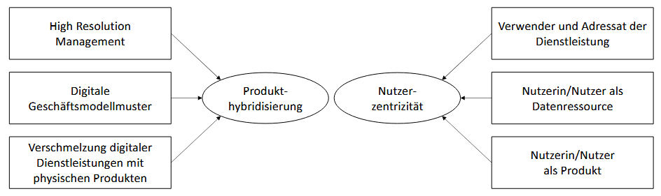
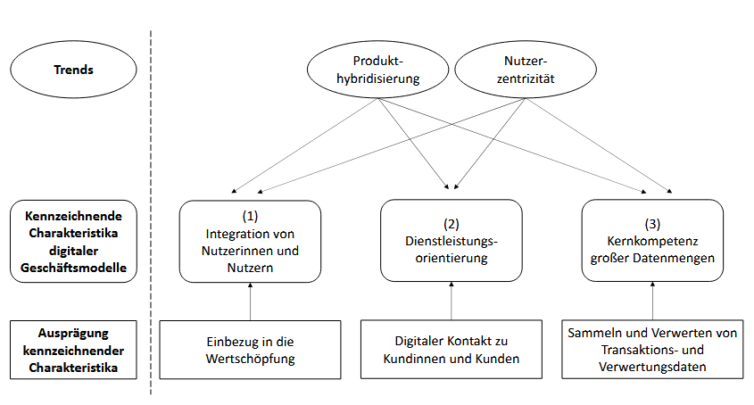
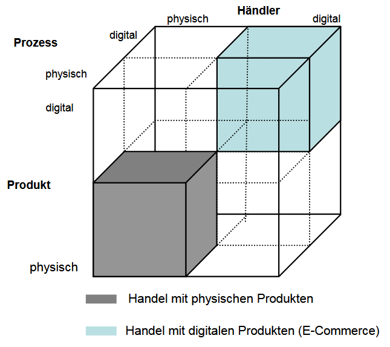

# Kapitel 4: Digitale Geschäftsmodelle und Produkte planen

In diesem Kapitel werden Sie ...

- ... digitale Geschäftsmodelle betrachten.
- ... digitale Produkte in den Fokus nehmen.

## Handlungssituation

Die ChangeIT GmbH möchte das Angebot für seine Kunden zukünftig umfassender gestalten und hat eine kleine Unternehmensberatung übernommen und als Abteilung integriert. Die Schnittstelle zwischen dem bisherigen IT-Systemhaus und der neuen Unternehmensberatungsschiene nehmen Sie ein.

Um die neue Abteilung auch den Bestandskunden des IT-Systemhauses bekannt zu machen, bemühen Sie sich um ein großes Referenzprojekt. Da kommt es Ihnen gelegen, dass im Rahmen der Wirtschaftsförderung von kleinen und mittelständischen Unternehmen (KMU) ein Wettbewerb des Technologie und Gründerzentrums ausgerufen wurde. An dem Wettbewerb beteiligen sich große Unternehmen, die auf neue Ansätze für Ihre Handlungen auf dem Markt bauen wollen.

Der Wettbewerb umfasst insbesondere die Weiterentwicklung der digitalen Produkte und Geschäftsmodelle der Konzerne. Bei entsprechender Qualität der Ergebnisse erhofft sich die ChangeIT auch über den Wettbewerb hinaus Aufträge aus dem Umfeld der großen Unternehmen.

Sie haben sich für ein Unternehmen entschieden. Führen Sie die Aufgaben in diesem Kapitel daher immer in Bezug auf die Handlungssituation des Wettbewerbs und auf das Unternehmen bzw. seine Branche durch.

Anbieter traditioneller Produkte und Dienstleistungen entwickeln diese im Rahmen der digitalen Transformation des Unternehmens, seiner Prozesse und Leistungen weiter. Dazu werden vielfach neue digitale Geschäftsmodelle erschlossen oder Produkte aus dem Bestand in die digitalen Lösungen überführt, wenn nicht sogar gänzlich neu erstellt.

## Kompetenz 4.0: Digitale Geschäftsmodelle anbieten

Im ersten Schritt schauen Sie sich das Geschäftsmodell des von Ihnen ausgewählten Unternehmens genauer an, um anschließend Ideen zur Weiterentwicklung zu sammeln. Dazu ist erstmal die Frage zu klären, was genau ein digitales Geschäftsmodell ist.

### A|4.0: Traditionelle und digitale Geschäftsmodelle unterscheiden

Wie unterscheiden sich traditionelle und digitale Geschäftsmodelle voneinander? Nutzen Sie das Informationsmaterial M|4.0.0: Digitale Geschäftsmodelle: Zugrundeliegende Trends und kennzeichnende Charakteristika zur Erarbeitung. Erstellen Sie sich eine Übersicht bspw. als Mindmap, Canvas etc. und geben Sie diese in dieser Aufgabe als .PDF-Datei ab.

Sie können sich an folgenden Fragestellungen orientieren:

1. Wer gehört zum Kundensegment eines Geschäftsmodells und wodurch wird dieses bestimmt?
2. Welche Art von Nutzen oder Leistung bietet ein Geschäftsmodell seinen Nutzerinnen und Nutzern?
3. Auf welche Weise entsteht innerhalb eines Geschäftsmodells wirtschaftlicher Wert?
4. Welche Bedingungen müssen erfüllt sein, damit von einer Geschäftsmodellinnovation gesprochen werden kann?
5. Inwiefern kann eine Veränderung von Kundengruppe und Leistungsangebot die Struktur eines Geschäftsmodells grundlegend verändern?
6. Welche Auswirkungen können digitale Geschäftsmodellinnovationen auf bestehende Marktstrukturen haben?
7. Was beschreibt der Begriff Produkthybridisierung im Zusammenhang mit digitalen Geschäftsmodellen?
8. Welche neuen Rollen übernehmen Nutzerinnen und Nutzer in digitalen Geschäftsmodellen?
9. Wie verändert sich die Beziehung zwischen Anbieter und Nutzer durch die Erhebung und Nutzung digitaler Daten?
10. Welche Stufen der digitalen Transformation eines Geschäftsmodells lassen sich unterscheiden?
11. Wie lässt sich ein Geschäftsmodell theoretisch einer bestimmten Digitalisierungsstufe zuordnen?
12. Was sind die zentralen Merkmale digitaler Plattformen im Vergleich zu klassischen Geschäftsmodellen?
13. Auf welche Weise tragen Nutzerinnen und Nutzer aktiv zur Wertschöpfung digitaler Geschäftsmodelle bei?
14. Welche allgemeinen Auswirkungen haben digitale Geschäftsmodelle auf Konsumverhalten und Alltag?
15. Welche strukturellen Überlegungen sind notwendig, um ein digitales Geschäftsmodell theoretisch zu entwerfen?

### M|4.0.0: Digitale Geschäftsmodelle: Zugrundeliegende Trends und kennzeichnende Charakteristika

**1. Geschäftsmodelle und Geschäftsmodellinnovation**

Ein Geschäftsmodell beschreibt, wie ein Unternehmen grundsätzlich funktioniert – also wie es Kunden bedient und dabei Geld verdient. Es geht dabei nicht in erster Linie um Zahlen, sondern um den Aufbau und die Struktur des Unternehmens. Obwohl es viele verschiedene Ansätze gibt, lässt sich ein Geschäftsmodell gut mit vier Fragen erklären: Wer bekommt was, unter welchen Bedingungen und auf welche Weise wird damit Wert geschaffen? Dieses sogenannte „Wer-Was-Wie-Wert“-Modell macht die Idee verständlich.

Zuerst steht die Frage nach dem „Wer?“, also: Wer sind die Kundinnen und Kunden? Nicht jedes Angebot richtet sich an alle. So wenden sich Autohersteller wie BMW oder VW an Menschen, die im privaten Individualverkehr mobil sein wollen. Wer hingegen mit Bus oder Bahn fährt, nutzt den öffentlichen Verkehr – ein ganz anderes Kundensegment.

Zweitens wird gefragt: „Was?“ – Was bietet das Unternehmen seinen Kunden an? In beiden Fällen, Auto und Bahn, geht es um Mobilität. Doch der Unterschied liegt im Detail: Ein eigenes Auto bietet mehr Privatsphäre, während man im Bus mit anderen fährt und keine Kontrolle über die Route hat.

Die dritte Frage lautet: „Wie?“ – Wie wird das Angebot bereitgestellt? Beim Auto geschieht das über den Kauf eines Fahrzeugs. Beim öffentlichen Verkehr zahlt man eine Fahrkarte für eine Dienstleistung, die man zu einem bestimmten Zeitpunkt nutzt. Die Art der Leistungserbringung ist also verschieden.

Zuletzt geht es um die Frage: „Wie wird Wert erzielt?“ Unternehmen müssen wirtschaftlich arbeiten. Das heißt: Sie müssen so kalkulieren, dass sie auf Dauer Gewinne machen. Beim Autohersteller geschieht das durch Verkauf oder Leasing von Fahrzeugen. Im öffentlichen Verkehr entsteht der Wert durch Ticketverkäufe – ohne dass das Verkehr smittel den Besitzer wechselt.

Zusammengefasst: Ein Geschäftsmodell erklärt, wie ein Unternehmen mit einem bestimmten Angebot für bestimmte Kunden wirtschaftlich erfolgreich sein kann – also wer was bekommt, wie es bereitgestellt wird und wie das Unternehmen daran verdient.

**2. Geschäftsmodellinnovation**

**2.1. Aufbau von Geschäftsmodellen**

Neben Produkt-, Dienstleistungs- und Prozessinnovationen gibt es auch Geschäftsmodellinnovationen. Sie gelten oft als besonders radikal, weil sie ganze Branchen verändern können. Dabei geht es aber meistens nicht um völlig neue Ideen, sondern um neue Kombinationen bekannter Bausteine – also um das „Wer?“, „Was?“, „Wie?“ und „Wert?“ eines Geschäftsmodells.

Von einer echten Innovation spricht man dann, wenn mindestens zwei dieser vier Elemente verändert werden. Das Neue liegt also nicht unbedingt im Produkt selbst, sondern darin, wie es angeboten und genutzt wird.

**2.2. Beispiele für Geschäftsmodellinnovationen**

*Tesla* hat das klassische Automodell grundlegend verändert:

- Es richtet sich vor allem an technikbegeisterte junge Kunden, die digital denken („Wer?“).
- Die Autos sind elektrisch, vernetzt und per Softwareupdate erweiterbar („Was?“).
- Verkauft wird online, ohne teure Autohäuser („Wie?“).
- Durch das Model 3 wurde das Angebot für einen größeren Markt zugänglich – das Geschäftsmodell wurde wirtschaftlich tragfähig („Wert?“).

*Uber* hat das Taxigeschäft neu gedacht:

- Es nutzt freiberufliche Fahrer mit eigenen Autos, statt einen eigenen Fuhrpark aufzubauen („Wie?“).
- Durch die App erreicht Uber vor allem junge, mobile Nutzer, die flexibel buchen wollen („Wer?“).

Auch *Google* dringt in die Verkehrswelt ein:

- Mit Google Maps und Android Auto ist Google schon in vielen Autos präsent.
- Das Google Car war ein Prototyp für ein vollautonomes Fahrzeug, das Nutzer per App steuern können.
- Damit werden ganz neue Zielgruppen angesprochen – zum Beispiel Menschen, die nicht selbst fahren können („Wer?“).
- Das Produkt selbst – ein Auto ohne Lenkrad – ist völlig neu gedacht („Was?“).

Diese Beispiele zeigen: Eine Geschäftsmodellinnovation verändert nicht nur das Produkt, sondern vor allem die Art, wie es vertrieben, genutzt und erlebt wird. Dadurch entstehen ganz neue Märkte – und bestehende Anbieter geraten unter Druck.

**3. Zugrundeliegende Trends digitaler Geschäftsmodelle**

**3.1. Produkthybridisierung und Nutzerzentrizität**

Digitale Geschäftsmodelle entstehen, weil sich auch unser Alltag immer stärker digitalisiert. Zwei große Trends aus dem Alltag wirken dabei besonders stark auf die Geschäftswelt ein: Produkthybridisierung und Nutzerzentrizität.

Produkthybridisierung bedeutet, dass digitale und physische Produkte miteinander verschmelzen. Ein Beispiel ist ein Fitnessarmband, das zwar ein physisches Produkt ist, aber viele digitale Funktionen hat – etwa Apps, Sensoren und Online-Analysen. In der Forschung spricht man hier von drei Kennzeichen:

1. High Resolution Management – Unternehmen erhalten sehr genaue Daten über ihre Produkte im Einsatz.
2. Digitale Geschäftsmodellmuster – Es entstehen neue Formen, wie mit solchen Produkten Geld verdient wird.
3. Kombination aus Dienstleistung und Produkt – z. B. ein Gerät, das zusammen mit einem digitalen Service funktioniert.

Der zweite Trend ist die Nutzerzentrizität. Dabei stehen die Kund*innen im Mittelpunkt. Sie sind nicht mehr nur Konsumenten, sondern übernehmen selbst verschiedene Rollen:

1. Sie nutzen das Produkt wie gewohnt.
2. Sie liefern Daten, zum Beispiel durch ihr Verhalten oder durch Feedback.
3. Sie werden selbst zum Teil des Produkts, etwa wenn ihre Daten für Empfehlungen oder Personalisierungen verwendet werden.

Diese beiden Trends – technologische Verschmelzung und aktive Nutzerrolle – zeigen, wie stark sich Alltagsverhalten auf moderne Geschäftsmodelle auswirkt. Unternehmen müssen sich darauf einstellen und ihre Geschäftsmodelle entsprechend anpassen.

*Abbildung 1: Produkthybridisierung und Nutzerzentrizität als die zwei identifizierbaren Trends, die mit zunehmender Digitalisierung der Alltagswelt einhergehen und sich auf die Geschäftswelt auswirken.*

**3.2. Wie sich die digitale Logik auf die physische Welt auswirkt**

Ein wichtiger Trend in der Entwicklung digitaler Geschäftsmodelle ist die Verschmelzung der digitalen und der physischen Welt. Vor allem durch das „Internet of Things“ (IoT) wird die physische Welt zunehmend von digitalen Prinzipien geprägt. Während digitale und reale Welt früher getrennt gedacht wurden (z. B. Onlinehandel vs. Ladenkauf), verschwimmen mit dem Fortschritt des Web 3.0 diese Grenzen.

IoT-Geräte – also vernetzte Gegenstände mit Sensoren und Aktoren – machen es möglich, dass physische Produkte wie Maschinen, Autos oder Haushaltsgeräte digitale Funktionen erhalten. Dadurch entstehen sogenannte hybride Produkte, die sich deutlich von herkömmlichen unterscheiden.

Dieser Wandel hat drei wichtige Folgen für Geschäftsmodelle:

- High Resolution Management: Durch Sensoren können Unternehmen präzise und in Echtzeit Daten erfassen. So können sie Produkte und Dienstleistungen genau anpassen. Ein Beispiel: Bei Google Ads bekommen Werbekunden sofort Rückmeldungen, wie oft ihre Anzeige geklickt wurde – solche Rückmeldungen gab es in der „analogen“ Werbung nicht.
- Digitale Geschäftsmodellmuster in der realen Welt: Digitale Prinzipien wie Pay-per-Use, Abo-Modelle oder datengesteuerte Services halten nun auch in der physischen Welt Einzug. Das wirft neue Fragen auf, zum Beispiel: Wem gehören die gesammelten Daten? Dem Hersteller, dem Nutzer oder dem Betreiber des Systems?
- Verschmelzung von Produkt und Service: Die Verbindung von Gerät, Konnektivität, Datenanalyse und digitalem Service ergibt ein einheitlich wahrgenommenes Produkt. Für Kund*innen wird der digitale Teil des Produkts oft so selbstverständlich, dass er mitentscheidend für den Kauf ist – etwa bei einem modernen Auto mit Navigations-App oder einem Fitnessgerät mit Online-Tracking.

Digitale Geschäftsmodelle übertragen sich zunehmend auf die reale Welt. Produkte sind heute oft nur dann erfolgreich, wenn sie digitale Dienste enthalten – und diese werden für Kund*innen zur Selbstverständlichkeit. Unternehmen müssen daher lernen, physische Produkte mit digitalen Lösungen zu verbinden, um wettbewerbsfähig zu bleiben.

**3.3. Die neue Rolle der Nutzerinnen und Nutzer in digitalen Geschäftsmodellen**

In der digitalen Plattformökonomie übernehmen Kundinnen und Kunden mehrere Rollen gleichzeitig. Laut Daum (2020) sind sie nicht nur klassische Nutzerinnen oder Nutzer einer Dienstleistung, sondern auch Datenquelle – und letztlich sogar Teil des Produkts. Denn durch ihre Interaktionen auf der Plattform (z. B. durch Suchen, Klicken oder Kommentieren) erzeugen sie Daten, die zur Verbesserung von Algorithmen und zur Personalisierung von Angeboten genutzt werden. Diese Daten können auch an Dritte verkauft werden, was für viele Plattformen ein zentraler Teil des Geschäftsmodells ist.

Gleichzeitig verändert sich der Markt selbst: Statt nur Anbieter zu steuern, was angeboten wird, bestimmen heute die Nachfragenden (also die Kundinnen und Kunden) immer stärker, was sie wollen. Sie sind nicht mehr nur Konsumenten, sondern aktive Mitgestalter: Sie geben Rückmeldungen, machen Verbesserungsvorschläge oder testen neue Produkte – und schaffen so gemeinsam mit dem Unternehmen neuen Wert. Dies nennt man Co-Kreation.

Damit Unternehmen Zugang zu ihren Kundinnen und Kunden bekommen, reicht heute nicht mehr nur ein guter Preis oder ein funktionierendes Produkt. Viel wichtiger ist es, emotionale Verbindungen zu schaffen. Diese sogenannte Identitätsleistung funktioniert besonders gut, wenn drei Dinge zusammenkommen:

1. Storytelling – Das Produkt erzählt eine Geschichte oder steht für etwas.
2. Lifestyle – Das Angebot passt zum Lebensstil der Kund*innen.
3. Identitätsbildung – Die Kund*innen können sich damit identifizieren.

Ein Beispiel: Viele Nutzerinnen und Nutzer entscheiden sich für Apple Pay, obwohl ihre Bank ebenfalls digitale Bezahllösungen anbietet. Der Grund ist, dass sie sich mehr mit Apple als Marke identifizieren können – sie fühlen sich damit moderner, technischer, unabhängiger. So wird das Unternehmen Teil der eigenen Identität.

In der digitalen Welt sind Kundinnen und Kunden nicht mehr nur Zielgruppe, sondern aktive Beteiligte, Datenquelle und Identifikationspartner. Unternehmen, die das verstehen, gestalten ihre Geschäftsmodelle entsprechend und schaffen engere, emotionalere Bindungen.

**4. Digitale Geschäftsmodelle**

**4.1. Was macht digitale Geschäftsmodelle aus? – Drei Ebenen der Digitalisierung**

Digitale Geschäftsmodelle unterscheiden sich darin, wie tief digitale Technik in ein Unternehmen eingebunden ist. Laut Matzler et al. (2018) gibt es drei Ebenen der Digitalisierung:

Produkt- und Dienstleistungsebene (digitization)

Auf dieser Ebene werden Produkte digitaler, z. B. durch Sensoren oder Fernsteuerung. Das bedeutet aber noch keinen grundlegenden Wandel im Geschäftsmodell. Ein Beispiel ist eine smarte LED-Lampe, die ihre Helligkeit per App oder Fernbedienung anpasst. Solche digitalen Ergänzungen schaffen zwar kurzfristige Vorteile, verändern das Unternehmen selbst aber kaum.

Prozess- und Entscheidungsebene

Hier wird die interne Arbeitsweise eines Unternehmens durch Digitalisierung effizienter. Es geht z. B. um Automatisierung, Datenanalyse oder individuelle Angebote. Dell etwa baut Computer erst dann, wenn jemand sie bestellt – so spart man Lagerkosten und kann Kundenwünsche besser umsetzen. Auch Domino’s Pizza zeigt, wie weit man Prozesse digitalisieren kann: Von der Bestellung bis zur Lieferung läuft alles digital, sodass sich das Unternehmen inzwischen eher als Technologieanbieter versteht.

Geschäftsmodellebene (digitalization)

Dies ist die tiefgreifendste und nachhaltigste Form der Digitalisierung. Sie verändert nicht nur Produkte oder Prozesse, sondern das gesamte Geschäftsmodell – also wie ein Unternehmen Wert schafft und Einnahmen erzielt. Dieser Wandel vollzieht sich in sechs Stufen:

1. Physisches Produkt oder Dienstleistung
2. Ergänzung durch Sensoren, Aktuatoren und WLAN → „Smartes Gerät“
3. Vernetzung mit anderen Geräten → Konnektivität
4. Datenanalyse → aus Sensoren gewonnene Informationen werden ausgewertet
5. Digitale Zusatzdienste entstehen auf Basis der Daten
6. Neues Geschäftsmodell mit neuem Nutzenversprechen und neuen Einnahmequellen

Ein Beispiel ist das Smart Home: Eine smarte Waschmaschine wäscht automatisch dann, wenn der Strom am günstigsten ist. Die Daten, wann Geräte wie viel Strom verbrauchen, können sogar an Stromanbieter weitergegeben werden – dafür zahlen diese Anbieter. Für die Nutzerinnen passiert das im Hintergrund – man nennt das „Hidden Revenue“, also versteckte Einnahmen, die ohne direktes Zutun der Kundinnen entstehen.

Digitale Geschäftsmodelle sind nicht einfach nur digitalisierte Produkte. Sie entstehen dann, wenn Technik, Daten und Vernetzung so miteinander kombiniert werden, dass neue Wege der Wertschöpfung und Einnahme entstehen. Je tiefer diese digitale Integration geht, desto nachhaltiger verändert sie das Unternehmen.

**4.2. Kennzeichnende Charakteristika digitaler Geschäftsmodelle**

Digitale Geschäftsmodelle unterscheiden sich von klassischen Geschäftsmodellen durch drei zentrale Merkmale, die auf den Arbeiten von Iansiti & Lakhani (2014) und Fleisch et al. (2014) basieren:

Einbindung der Nutzerinnen und Nutzer

Digitale Geschäftsmodelle binden Kund*innen aktiv in den Wertschöpfungsprozess ein. Nutzer übernehmen Aufgaben, die früher vom Unternehmen erledigt wurden – z. B. das Schreiben von Bewertungen bei Google Maps oder Tripadvisor. Man nennt das auch "Internalisierung": Die Kundschaft wird ein Teil des Produkts oder der Dienstleistung.

Dienstleistungsorientierung

Der Kontakt zum Kunden erfolgt heute meist digital über Apps oder Plattformen, nicht mehr persönlich im Geschäft. Dabei geht es nicht nur um den Kauf, sondern auch um zusätzliche IT-gestützte Dienste nach dem Kauf, wie z. B. Updates, Empfehlungen oder Bonusprogramme. Die klassische Kundenkarte ist heute oft eine App-Funktion.

Umgang mit großen Datenmengen („Analytics“)

Digitale Geschäftsmodelle sammeln und analysieren riesige Mengen an Daten. Diese Daten – etwa aus Käufen, Suchanfragen oder Bewertungen – helfen, Angebote zu personalisieren, Preise festzulegen und Produkte zu verbessern. Das Ziel ist: passgenaue Werbung, optimale Produktempfehlungen und effizientere Verkaufsstrategien.

Beispiel: Plattformkapitalismus

Diese drei Merkmale werden besonders deutlich bei digitalen Plattformen wie Airbnb, Google oder Amazon. Diese Unternehmen stellen eine Grundplattform zur Verfügung, auf der andere Anbieter ihre Leistungen anbieten. Die Plattformen selbst haben:

- direkten Kontakt zu den Kund*innen (ohne Zwischenhändler),
- Echtzeit-Zugriff auf Daten,
- einfache, intuitive Bedienung,
- schnelle Reaktionsmöglichkeiten.

Die Nutzer*innen tragen Inhalte bei (z. B. Bewertungen), kommunizieren über die Plattform und werden über spielerische Elemente („Gamification“) zusätzlich motiviert.

Digitale Geschäftsmodelle leben von aktiver Kundenbeteiligung, digitalem Service und der Nutzung großer Datenmengen. Wer diese drei Elemente geschickt kombiniert, kann Märkte grundlegend verändern – wie es Plattformanbieter weltweit bereits erfolgreich tun.

*Abbildung 2: Trends wirken auf die kennzeichnenden Charakteristika digitaler Geschäftsmodelle ein.*

**5. Fazit**

**5.1. Was digitale Geschäftsmodelle ausmacht und warum sie wichtig sind**

In diesem Beitrag wurde erklärt, was ein Geschäftsmodell ist und wie digitale Geschäftsmodelle entstehen. Zentrale Erkenntnis: Digitale Geschäftsmodelle unterscheiden sich nicht in ihrem grundsätzlichen Aufbau von klassischen Modellen – sie bestehen ebenfalls aus den Fragen „Wer bekommt was, auf welche Weise und unter welchen Bedingungen?“ Entscheidend ist, dass in digitalen Geschäftsmodellen digitale Elemente wie Sensoren, Daten oder digitale Dienste eingebunden werden.

Ein wichtiger Baustein ist dabei die Geschäftsmodellinnovation. Sie bedeutet, dass bekannte Bestandteile neu kombiniert werden – entweder schrittweise (evolutionär) oder stark verändernd (disruptiv). Zwei große Trends spielen dabei eine Rolle:

- Produkthybridisierung: Digitale Technik wird in physische Produkte integriert (z. B. smarte Geräte im Smart Home). Die Grenzen zwischen digitaler und realer Welt verschwimmen.
- Nutzerzentrizität: Nutzer*innen übernehmen neue Rollen – sie verwenden Produkte nicht nur, sondern liefern Daten und werden selbst zum Teil des Geschäftsmodells.

Daraus ergeben sich drei Hauptmerkmale digitaler Geschäftsmodelle:

- Integration der Nutzenden (z. B. durch Bewertungen oder Interaktion),
- Dienstleistungsorientierung (z. B. digitale Kundenservices über Apps),
- Analytics (Datenerfassung und -auswertung für Personalisierung und Optimierung).

Diese Merkmale werden deutlich in Beispielen wie Airbnb, Google oder Amazon – große Plattformen, die Kund*innen direkt ansprechen, Daten nutzen und digitale Dienste in den Mittelpunkt stellen.

**5.2. Drei Ebenen der Digitalisierung (nach Matzler et al. 2018)**

- Produkt- und Dienstleistungsebene: analoge Produkte werden digital erweitert (digitization).
- Prozess- und Entscheidungsebene: Abläufe im Unternehmen werden digitalisiert und effizienter.
- Geschäftsmodellebene: Das Geschäftsmodell selbst wird durch digitale Möglichkeiten neu gedacht – das ist die tiefgreifendste und nachhaltigste Form der Digitalisierung.

**5.3. Bedeutung für Unternehmen**

Digitale Geschäftsmodelle sind heute oft entscheidend für den Markterfolg. Kund*innen achten nicht nur auf Preis oder Qualität, sondern zunehmend auch auf digitale Services, Datenkomfort und Identifikation mit der Marke. Wer sich also in Zukunft behaupten will, muss mehr als nur Technik einführen – es braucht Fachleute, die digitale Geschäftsmodelle verstehen, entwickeln und umsetzen können.

**5.4. Abschließender Ausblick**

Damit digitale Geschäftsmodelle langfristig erfolgreich sind, ist eine klare Kommunikation notwendig – z. B. über Storytelling in sozialen Medien, mit der sich Kund*innen identifizieren können. So entsteht Vertrauen und eine dauerhafte Kundenbindung. Unternehmen, die sich frühzeitig auf diese Veränderungen einstellen, sichern sich Vorteile in einer zunehmend digitalen Wirtschaft.

---

**Vereinfachte Version von:**  Metzger, Frederik M. (2023): *Digitale Geschäftsmodelle: Zugrundeliegende Trends und kennzeichnende Charakteristika.* In: Innovation Systems and Policy Analysis. Fraunhofer ISI Discussion Papers Nr. 81. [Originaltext](https://publica-rest.fraunhofer.de/server/api/core/bitstreams/a03f4786-24e9-4d32-8ba8-d5480317a252/content)

## Kompetenz 4.1: Digitale Produkte gestalten

Eng mit dem digitalen Geschäftsmodell sind digitale Produkte verküpft. Viele Unternehmen mit klassischen physischen Produkten stellen zunehmend Produkte mit höherem Digitalisierungsgrad her. Auch hierzu sollen im Rahmen des Wettbewerbs Ideen der Weiterentwicklung gesammelt werden.

### A|4.2: Digitale Produkte und physische Produkte abgrenzen

Produkte werden digitaler oder voll digitalisiert. Verschaffen Sie sich einen Überblick über die Digitalisierung von Produkten anhand des Informationsmaterials im Kurs:

- M|4.2.0: Digital Reframing: In diesem Material wird beschrieben, dass auch bestehende Produkte in Unternehmen digitaler gestaltet werden können, ohne disruptiv neue Produkte auf den Markt zu bringen.
- M|4.2.1: Grundlagen zu digitalen Produkten: In diesem Material wird genauer beleuchtet, was eigentlich digitale Produkte sind und welche weiteren Rahmenbedingungen hinsichtlich der Vermarktung bestehen können.
- M|4.2.2: KfW Research: Digitalisierung im Mittelstand: Dieses Material dient als Informationsquelle, um die Arten von Digitalisierungsvorhaben in der Wirtschaft genauer zu betrachten. Außerdem wird hierin auch dargelegt, welche Häufigkeiten die Arten der Digitalisierungsvorhaben aufweisen.

**Aufgabe 1**

Beschreiben Sie zusammenfassend, welche Möglichkeiten Unternehmen haben, um teildigitale oder volldigitale Produkte zu entwickeln. Geben Sie dabei auch Vorteile und Risiken der verschiedenen Optionen für Digitalisierungsvorhaben an.

**Aufgabe 2**

Welche voll- oder teildigitalisierten Produkte bestehen bereits in dem von Ihnen ausgewählten Unternehmen? Beschreiben Sie diese kurz und versuchen Sie eine Einordnung gemäß der Informationen aus Aufgabe 1.

**Aufgabe 3**

Wie könnte sich das von Ihnen ausgewählte Unternehmen weiterentwicklen? Gibt es digitale oder zunehmend digitalsierte Produkte, die Sie sich in der Gruppe gut vorstellen könnten? Beschreiben Sie mindestens eines genauer unter Berücksichtigung der SWOT-Analyseergebnisse hierzu.

**Hinweise zur Abgabe**

- Halten Sie fest, welche Quellen Sie für Informationen im Rahmen der Analysen verwendet haben.
- Sollten Sie zur Informationseinholung oder ähnlichen Prozessschritten KI-Tools anwenden, ist zwingend der M|0.3: KI-Leitfaden für den Unterricht einzuhalten.
- Sie geben als Gruppe gemeinsam ein Dokument mit allen bearbeiteten Analysen ab. Eine Person aus der Gruppe lädt das Dokument als Gruppenlösung in der Aufgabe hoch. Nach Upload gilt die Einreichung als vollständig. Eingereichte Dokumente können durch jedes Gruppenmitglied nochmals aktualisiert hochgeladen werden.

### M|4.2.0: Digital Reframing

**Vom klassischen Produkt zum digitalen Produkt – Wie Innovation durch „Digital Reframing“ entsteht**

Die Umgestaltung klassischer, physischer Produkte in digitale Produkte ist eine besonders tiefgreifende Form der digitalen Innovation. Dabei geht es nicht nur darum, ein Produkt mit Technik auszustatten, sondern es grundlegend neu zu denken – unter Nutzung digitaler Technologien, die oft gar nicht so neu sind, wie sie scheinen.

**Warum das wichtig ist**

In einer zunehmend digitalen Welt müssen sich sowohl traditionelle Unternehmen als auch digital geprägte Firmen anpassen. Wenn sie nicht verstehen, wie digitale Produkte entstehen, besteht die Gefahr, dass ihre klassischen Produkte vom Markt verdrängt werden. Dabei ist auffällig: Viele digitale Produkte, die wir heute nutzen – etwa E-Books, Online-Banking oder Smartwatches – basieren auf alten Ideen und bestehenden Technologien. Neu ist die Kombination dieser Elemente.

**Wie funktioniert dieser Innovationsprozess?**

Eine aktuelle Studie geht der Frage nach: Wie kann man vorhandene digitale Technologien so einsetzen, dass daraus ein innovatives digitales Produkt entsteht?

Die Antwort liefert ein Konzept, das „Digital Reframing“ genannt wird – also das Neurahmen von Produkten mithilfe digitaler Technologien. Die Forschenden haben dazu den Entstehungsprozess eines innovativen digitalen Theaters untersucht. Sie zeigen, wie Designer in drei Schritten vorgehen:

1. Frame Taking: Die Gestaltenden betrachten vorhandene digitale Technologien und deren Einsatzmöglichkeiten. Sie „nehmen“ die Sichtweise (engl. „frame“) dieser Technologien ein.
2. Frame Merging: Diese Sichtweise wird mit der bisherigen Funktion und Form des Produkts kombiniert. Es entsteht ein neues Konzept, das beide Welten – die digitale und die physische – vereint.
3. Frame Giving: Schließlich wird das Ergebnis so präsentiert, dass Nutzer*innen das neue digitale Produkt als sinnvoll, nützlich und innovativ wahrnehmen können.

Dieser Prozess zeigt: Innovation muss nicht bedeuten, das Rad neu zu erfinden. Oft reicht es, vorhandene Bausteine geschickt neu zu kombinieren und ihnen eine andere Bedeutung zu geben.

**Was lernen wir daraus?**

Die Studie macht deutlich, dass digitale Innovation nicht nur technische Expertise erfordert, sondern auch kreatives und strategisches Denken – etwa im Designprozess. Für Unternehmen bedeutet das:

- Sie sollten nicht nur neue Technik entwickeln, sondern auch bestehende Technik anders denken.
- Digitale Produkte brauchen eine gute Geschichte – ein neues „Frame“, also eine neue Sichtweise, die Nutzer*innen überzeugt.

**Fazit**

Digitale Innovation entsteht häufig nicht durch das Erfinden völlig neuer Technologien, sondern durch das geschickte Zusammenspiel von Alt und Neu. Entscheidend ist dabei, wie Produkte „neu gerahmt“ und interpretiert werden. Dieses Denken in neuen Zusammenhängen – das sogenannte „Digital Reframing“ – ist ein Schlüssel für erfolgreiche digitale Geschäftsmodelle.

---

**Abgeleitet aus dem Abstract von:**  Wang, Gongtai (2021). *Digital reframing: The design thinking of redesigning traditional products into innovative digital products.*   Originaltext

### M|4.2.1: Grundlagen zu digitalen Produkten

**1. Was sind digitale Produkte – und was macht sie besonders?**

Digitale Produkte unterscheiden sich deutlich von physischen Produkten. Der wichtigste Unterschied ist ihre Immaterialität: Sie bestehen nicht aus einem greifbaren Material, sondern aus Daten und können daher vollständig elektronisch gehandelt werden. Dazu zählen z. B. Musikdownloads, eBooks, Software oder Online-Zeitungen.

Damit ein Produkt als vollständig digital gilt, müssen drei Dinge digital sein:

1. Das Produkt selbst (z. B. ein Musiktitel),
2. der Handelsprozess (z. B. Bezahlung und Download über eine Website),
3. der Vermittler (Makler), also z. B. eine Online-Plattform oder App.

**1.1 Arten digitaler Produkte**

Man unterscheidet drei Gruppen:

- Digitale Informationsgüter (z. B. eBooks, wissenschaftliche Texte): Sie werden wegen ihres Inhalts gekauft.
- Digitale Güter im engeren Sinne (z. B. Software): Sie werden wegen ihrer Funktion gekauft – der genaue Inhalt (z. B. Programmcode) ist für die Nutzer*innen meist unwichtig.
- Digitale Dienstleistungen (z. B. Online-Beratung durch eine Versicherung): Sie brauchen aktive Mitwirkung der Kundschaft.

In der Wirtschaft spricht man häufig allgemein von „digitalen Produkten“, womit meist die ersten beiden Gruppen gemeint sind.

**1.2 Typische Eigenschaften digitaler Produkte**

Digitale Produkte haben Eigenschaften, die sie klar von physischen Produkten unterscheiden:

1. Nicht abnutzbar: Sie altern nicht – eine Datei wird durch Benutzung nicht schlechter. Ein „gebrauchtes“ digitales Produkt gibt es nicht.
2. Einfach veränderbar: Digitale Produkte lassen sich leicht anpassen oder weiterentwickeln – z. B. durch Software-Updates oder neue Versionen.
3. Einfach kopierbar: Eine digitale Datei kann fast kostenlos beliebig oft kopiert werden. Nur die erste Version („first copy“) kostet Geld. Danach sind die Grenzkosten fast null. Dadurch kann man sehr viele Kopien günstig anbieten und hohe Gewinne erzielen („economies of scale“).

**1.3 Wirtschaftliche Besonderheiten und Herausforderungen**

Weil digitale Produkte so einfach kopiert werden können, stellen sich ökonomisch neue Fragen:

- Sind digitale Produkte knapp oder unbegrenzt verfügbar? Eigentlich könnte jede*r unbegrenzt auf digitale Inhalte zugreifen – so wie bei einem öffentlichen Gut. Damit daraus ein marktfähiges Produkt wird, braucht es Gesetze wie das Urheberrecht, das die Nutzung einschränkt und schützt.
- Wie funktioniert der Wettbewerb? In klassischen Märkten begrenzt die Produktionskapazität das Angebot. Bei digitalen Produkten gibt es keine Produktionsgrenze. Deshalb kann man die üblichen Regeln der Mikroökonomie (wie das Gewinnmaximum bei gegebener Kapazität) nicht direkt anwenden.
- Unvollkommener Markt: Da digitale Produkte sehr unterschiedlich (also nicht homogen) sind, ihre Preise oft über den Grenzkosten liegen und staatliche Eingriffe nötig sind, spricht man hier von einem unvollkommenen Markt.

*Abbildung 1: Einordnung von vollständig digitalem und traditionellem Handel*

**Vereinfachte Version von:** Seidenfaden, Lutz (2006). *Absatz digitaler Produkte und Digital Rights Management:* Ein Überblick. In: Hagenhoff, Svenja (Hrsg.). Internetökonomie der Medienbranche. Universitätsverlag Göttingen. [Originaltext](https://library.oapen.org/bitstream/handle/20.500.12657/37280/mediaconomy_book.pdf?sequence=1#page=41)

### M|4.2.2: KfW Research: Digitalisierung im Mittelstand

[KfW Research](material/04_kfw_report.pdf)

## Handlungsergebnis

Für die dritte Phase des Wettbewerbs haben Sie sich mit digitalen Geschäftsmodellen und Produkten für das ausgewählte Unternehmen auseinandergesetzt. Ihre Ergebnisse sollen nun in Form einer Präsentation dargestellt und ausgewertet werden. Dieser Schritt bildet den Abschluss der dritten Phase und damit den letzten Meilenstein des Wettbewerbs.

### A|4.3: Vorstellung der digitalen Geschäftsmodelle und Produkte

Wie Sie die Arbeit innerhalb der Gruppe aufteilen, kann von Ihnen entschieden werden. Wichtig ist, dass alle Gruppenmitglieder am Ende ...

    ... jede Analyse auch selbst durchführen können,
    ... über die Ergebnisse im Bilde sind,
    ... das Gesamtergebnis der Gruppe vertreten.

**Aufgabe 1**

Nutzen Sie die Ergebnisse aus den Aufgaben A|4.0: Traditionelle und digitale Geschäftsmodelle unterscheiden, A|4.1: Digitale Geschäftsmodelle entwickeln sowie A|4.2: Digitale Produkte und physische Produkte abgrenzen zum Abschluss der Tätigkeiten im Wettbewerb. Ergänzen Sie die Ergebnisse im Gesamtdokument als Kapitel 5. Finden Sie selbstständig sinnvolle Überschriften zur Einbettung.

**Aufgabe 2**

Erstellen Sie auf Basis des nun fertiggestellten Gesamtdokuments eine Präsentation mit einem Zeitumfang von 10-15 Minuten. Inhalt der Präsentation soll wie folgt gegliedert sein:

1. Kurze allgemeine Vorstellung des von Ihnen ausgewählten Unternehmens und seiner Branche.
2. Vorstellung der wichtigsten / interessantesten / für den Fortgang der Präsentation relevanten Analyseergebnisse aus Kapitel 2.
3. Vorstellung der wichtigsten / interessantesten / für den Fortgang der Präsentation relevanten Ergebnisse aus Kapitel 3.
4. Vorstellung der bisherigen und ggf. zukünftig zu betrachtenden digitalen Geschäftsmodelle aus Kapitel 4.
5. Vorstellung der bisherigen und ggf. zukünftig zu betrachtenden digitalen oder teildigitalisierten Produkte aus Kapitel 4.

**Aufgabe 3**

Reflektieren Sie gemeinsam Ihre Arbeit als Gruppe. Nutzen Sie dazu das bereits bekannte Informationsmaterial M|2.2.1: Reflexion von Gruppenarbeiten als Hilfestellung. Sie müssen nicht alle Fragen, die in dem Material aufgeführt sind beantworten. Greifen Sie sich als Gruppe die für Sie wichtigen Themen heraus. Die Reflexion wird als gemeinsame Datei ebenfalls in dieser Aufgabe abgegeben. Ihre Reflexion sollte genau eine DIN A4-Seite umfassen. Nutzen Sie dafür erneut die Vorlage M|2.2.2: Vorlage zur Reflexion.

**Hinweise zur Abgabe**

- Erweitern Sie im Dokument das Literaturverzeichnis, in welchem Sie die Quellen für Ihre Analysen angeben.
- Sollten Sie zur Informationseinholung oder ähnlichen Prozessschritten KI-Tools anwenden, ist zwingend der M|0.3: KI-Leitfaden für den Unterricht einzuhalten.
- Benennen Sie die Dokumente nach folgendem Muster:
   - Unternehmen_Doku_3_NachnameV_NachnameV_NachnameV_NachnameV.pdf
   - Unternehmen_Reflexion_3_NachnameV_NachnameV_NachnameV_NachnameV.pdf
   - Unternehmen_Präsentation_3_NachnameV_NachnameV_NachnameV_NachnameV.pptx
- Sie geben als Gruppe gemeinsam das Dokument und die Präsentation sowie die Reflexion ab. Eine Person aus der Gruppe lädt das Dokument als Gruppenlösung in der Aufgabe hoch. Nach Upload gilt die Einreichung erst dann als vollständig, wenn alle Gruppenmitglieder die Abgabe in Moodle über den entsprechenden Button bestätigt haben. Eine Änderung ist im Anschluss nicht möglich.
- Da eine separate Bewertung mit der Notenfrist für diesen Aufgabenteil nicht realisierbar ist, gehen die Arbeiten im Rahmen der allgemeinen Mitarbeit in die Note ein.

